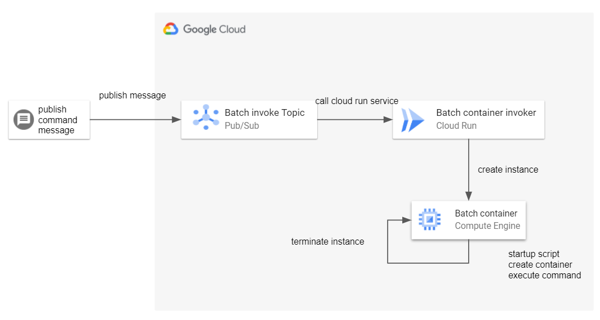

# gcp-container-batch

This is a mechanism to execute arbitrary commands in a container on GCE.

It was created to run long-running batch containers on GCP.

## Requirements

* Terraform 1.1.0
* Docker 20.10.2 or higher
* Google Cloud SDK 344.0.0 or higher

## Architecture


## How it works

If you throw a message to a PubSub topic as follows, it will create a container instance in the Compute Engine and execute the command passed in the message content.
The created instance will be automatically deleted after the command is completed.

Automatic termination of container instances base on [this cool post](https://stackoverflow.com/a/58215421).

```
$ gcloud pubsub topics publish create-batch-instance-topic --message="gcloud --help" --attribute=image_name="gcr.io/google.com/cloudsdktool/cloud-sdk:latest"
```


## GCP resources created by Terraform

|Resource|name|
|:-------|----|
|Service account|pubsub-message-publisher|
|PubSub topic|create-batch-instance-topic|
|PubSub subscription|create-batch-instance-subscription|
|Cloud Run Service|run-container-on-gce|

See detail [terraform](./terraform) sources.


## License

This software is released under the MIT License, see [LICENSE.txt](./LICENSE.txt).
